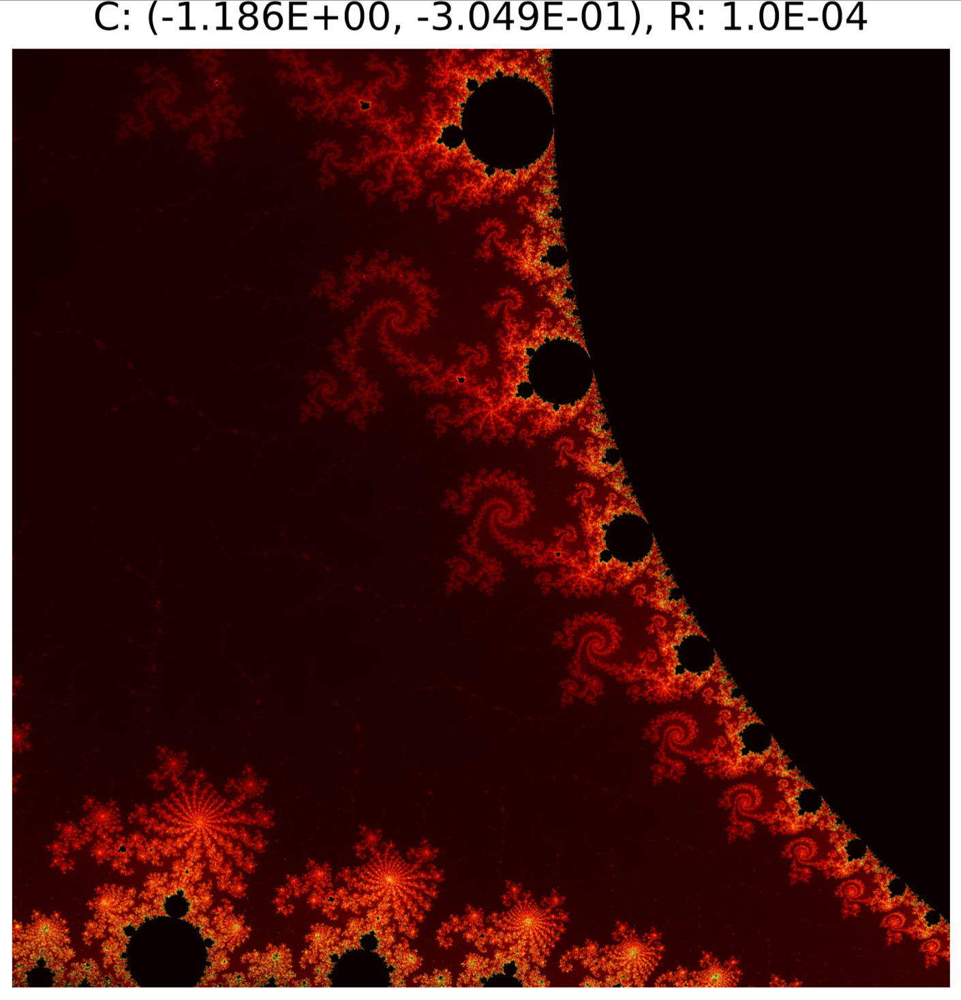

# Introduction 
This is a C program to compute the Mandelbrot Set implemented in multiply versions including the serial implementation and two parallellized versions using MPI. A small program written in Python is used for plotting. 

# Compile
Dependencies: [openmpi](https://www.open-mpi.org/)  
Python dependencies: [matplotlib](https://matplotlib.org/)  

Compile:
```bash
$ make all 
```
This will generate 3 versions of the program: 

- `mandelserial` - a serial implementation 
- `mandelequal` - a parellelized implementation with cyclic data partition (loop splitting)  
- `mandelmaster` - a parellelized implementation with master-slave dynamic data partition. Minimum number of processors: 2.


# Usage
For the serial implementation:
```bash
$ ./mandelserial <x> <y> <radius> <resolution> <maxIter> <filename>  
```

For the parellezed versions:
```bash
$ mpirun -n <cores> <executable> <x> <y> <radius> <resolution> <maxIter> <filename>
```

The arguments 
- `x y` - the complex number at the center of the region.  
- `radius` - half width of the window   
- `resolution` - resolution of the image
- `maxIter` - maximum number of iterations allowed  
- `filename` - output file name. Optional. If not given, no outputfile will be printed.


# Plot
The script `plot.py` can use the output file to generage the image with the same name. `cmap` is optional, stands for colormap.  
```bash
$ python plot.py <x> <y> <radius> <filename> <cmap>
```

# Example
Example of usage and plot:
```bash
$ mpirun -n 4 mandelmaster -1.185774 0.3049146 0.0001 5000 outfile
$ python3 plot.py -1.185774 0.3049146 0.0001 outfile hot
```




